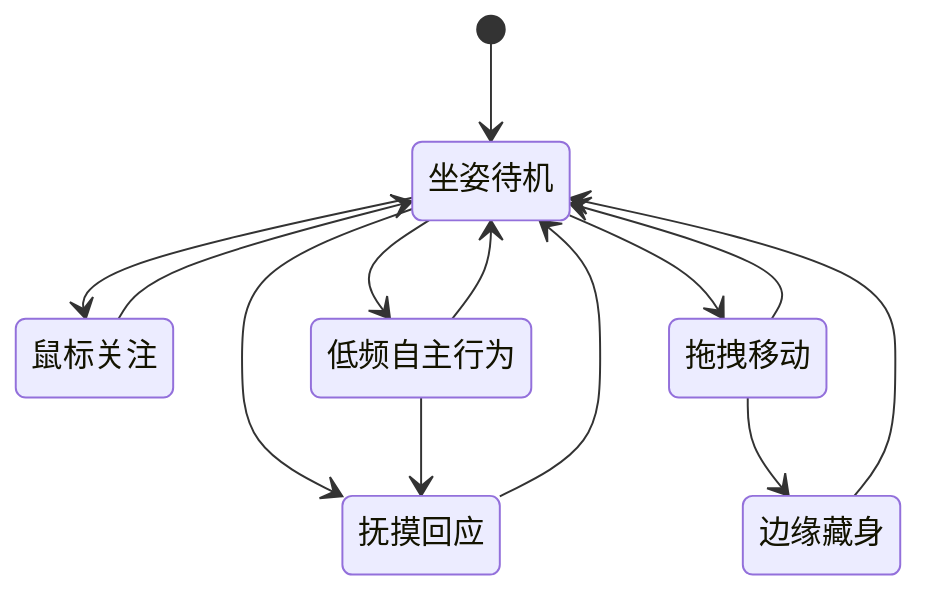

# 猫咪形象与动态视觉专项设计

> **⚠️ 路线已淘汰（历史留痕）：** 本文是 2026-08-12「动画电影软萌风 + Live2D」路线的专项设计，已于 **2026-08-18** 被**像素照片分身路线**（pixel-style-v1，16-bit 硬边像素插画）取代，**不再执行**。当前权威：`docs/项目开发交接文档-2026-08-19.md`、`docs/superpowers/specs/2026-08-18-真实宠物像素分身路线设计.md`、`docs/设计/猫咪A风格视觉规范.md`。

## 1. 文档状态

- 日期：2026-08-12
- 状态：设计已确认，待用户审阅后编写实施计划
- 适用范围：Windows 桌宠 MVP 的下一阶段；仅覆盖猫
- 前置文档：`docs/新对话开发交接摘要-2026-08-12.md`
- 2026-08-14 方向修正：真实宠物照片生成是产品主线；标准猫只承担公共技术基线验证。体型与动作空间以 `docs/superpowers/specs/2026-08-14-真实宠物体型模块与动作适配专项设计.md` 为准。
- 2026-08-15 方向校准：A 风格保持不变；照片输入、AI 补全、完整动态角色后置预览、隐私、恢复和阶段顺序以 `docs/superpowers/specs/2026-08-15-真实宠物照片分身生成方向校准设计.md` 为准。本文第 5 节、9.1 节照片会话字段、10.1 节第 3 项和第 11 节中与新规格冲突的内容已被取代，不得继续执行。

## 2. 决策摘要

本阶段不再追求“照片里的猫直接走到桌面上”的写实效果，也不再把现有写实 Live2D 猫作为正式视觉基线。产品统一采用 **A：动画电影软萌风**：保留真实猫的辨识特征，但始终以可爱、柔和、富有生命感的动画猫呈现。

为避免歧义，本文使用以下名称：

- **照片分身猫**：用户上传自家猫照片后生成的 A 风格猫咪分身，不是写实复刻。
- **标准领养猫**：不依赖照片、可直接选择的预设猫。
- **标准猫**：用于验证 Live2D 动作、交互和后续边缘藏身公共能力的一只基线角色，不等同于真实照片分身或最终六只领养猫。

近期正式技术路线是 **参数化 Live2D 基线**：统一动作语义、角色包接口和验收方法，搭配有限的预绑定形体模块与可替换专属外观层。不同体型不得直接套用同一组固定像素作用区域；每只猫必须选择兼容形体模块，并携带自己的动作空间档案和安全幅度。

单猫完整专属 Live2D 模型是后续的品质升级目标，不进入本阶段交付。直接从照片自动拆层并绑定 Live2D 的路线不作为产品承诺。

## 3. 目标与非目标

### 3.1 目标

1. 只把猫做透：建立统一、可执行、可扩展的 A 风格视觉标准。
2. 让照片分身猫“一眼看得出是它”，并稳定地保留毛色花纹、脸型、耳形、眼型、可识别体型、尾巴、局部纹路和整体气质等可见特征；不得为了复用标准猫而把所有宠物强制生成成同一身材。
3. 让桌宠从“整图轻微呼吸”升级为自然的 Live2D 陪伴角色，先稳定交付 8 组坐姿动作与互动。
4. 提供“边缘藏身”能力：用户不必完全隐藏宠物，也能显著降低遮挡。
5. 保持低使用门槛：一张合格照片可完成生成；第二张照片仅是可选增强。
6. 保留两项产品核心功能：照片分身猫为首页主入口，标准领养猫为次入口。
7. 明确交付优先级：照片分身猫的生成质量和完整链路高于标准领养猫；领养猫不得反向阻塞或稀释照片分身猫的质量门槛。

### 3.2 非目标

- 不支持猫以外的动物。
- 不承诺逐根毛发、不可见身体部位或照片中单一姿势的像素级复刻。
- 不在首期提供多姿态完整行为系统；坐、趴、站、洗脸、踩奶等属于终极目标的后续阶段。
- 不为每只猫制作独立的完整 Live2D 模型。
- 不提供复杂手动捏脸、花纹位置编辑、服饰或配饰系统。
- 不采集或合成每只真实猫的专属声音。
- 不做可设置的性格系统；所有猫共用同一套陪伴节奏。

## 4. 视觉与角色规范

### 4.1 A 风格标准

- 风格：动画电影软萌风；毛绒感、温和体积光、清晰但柔软的轮廓、自然亲和的表情。
- 比例：构图保持平衡、正面坐姿和非玩偶化，但保留真实宠物可识别的体型类别。首期支持纤细型、均衡型、圆润型三种预绑定身体模块；不得把“平衡构图”解释成所有猫使用同一身体比例。
- 主姿态：正面坐姿。它是所有待机、鼠标关注、抚摸回应和首期自主动作的默认姿态。
- 真实感来源：个体特征，而不是照片质感。即使来自用户照片，角色也必须保持 A 风格而非呈现写实照片感。
- 个体化范围：毛色与花纹、面部轮廓、耳形、眼型与眼睛颜色、身形、尾巴、明显局部纹路和神态气质。

照片中未出现或无法可靠识别的区域，按已选形体模块和该猫可见特征作风格化补全；界面不得把这种补全表述为“精准复刻”。

### 4.2 角色包结构

每只可运行的猫都是一个版本化的 **A 风格 Live2D 角色包**，由以下内容组成：

1. **共用动作语义**：统一 Cubism 参数名称、动作名称、状态优先级和归一化输入；具体变形器、网格作用范围和安全幅度由形体模块决定，不要求不同体型共享完全相同的形变网格。
2. **预绑定形体模块**：脸型、耳形、眼型、身形和尾巴。模块先绑定并通过动作验收，再被照片分身猫或领养猫选用。
3. **专属外观层**：毛色、花纹、眼睛颜色、局部纹路和面部特征等贴图及遮罩；它们遵守同一画布、锚点和变形约束。
4. **完整身体底图**：先补全耳根后头部、眼睑下完整眼球、口鼻下脸部、前肢后胸腹和尾根后身体，再从连续底图切分活动部件；不得用透明占位层或只在中性姿势成立的缝隙遮挡替代。
5. **独立尾巴结构**：尾巴必须是从尾根到尾尖可独立变形的完整 ArtMesh；`bodyUnderTail` 提供尾巴后方连续身体，`tailReserve` 只负责尾根局部重叠，三者不得粘死在同一纹理层。
6. **动作清单**：角色包必须声明支持的 8 个动作组、边缘尾巴状态和模型版本。缺任一必需资源时不能安装为可用宠物。
7. **动作空间档案**：角色包必须携带 `MotionSpatialProfileV1`，使用归一化坐标记录主体轮廓、脸部安全区、双眼、双耳根、胸腹呼吸区、身体伸展轴、摆动中心、尾根和尾部可见区，并记录动作安全幅度。固定画布尺寸不能替代该档案。

角色包的动作语义版本固定为明确的 `cat-a-live2d-v1`；形体模块在该语义下分别版本化。以后升级时采用新增版本和迁移策略，不能静默替换已生成猫的资源。

### 4.3 体型模块与动作空间

- 首期身体模块固定为 `body-slender-v1`、`body-balanced-v1`、`body-rounded-v1`。脸、耳、眼和尾模块仍需声明与身体模块的兼容关系。
- 统一画布只解决资源尺寸和锚点交换，不决定呼吸、眨眼、耳动或尾巴动作的实际像素范围。
- 同一个归一化动作值在不同模块中可对应不同的网格、轴心和最大形变量。例如圆润型的呼吸作用区可以更宽，纤细型主要作用于胸腔；长毛外轮廓需限制拉伸以避免毛边橡胶化。
- 照片分析只能从白名单形体模块中选择，不得生成任意比例后强套标准猫网格。关键体型资料不足时由 AI 推断并补全合理体型，记录为 `ai-completed`，最终预览明确说明；不得静默回退 `body-balanced-v1`。只有输入无法支持合理生成时才停止。
- 每个形体模块必须独立通过中性姿态、动作峰值、回退姿态和局部安全区验收；照片分身猫安装前还要重新执行角色级动作回归。

### 4.4 标准领养猫

首批提供 6 只标准领养猫：橘猫、狸花、黑猫、奶牛猫、白猫、长毛猫。它们必须与照片分身猫使用同一 A 风格规范、同一动作语义版本、兼容形体模块和同一动作能力；不能再混入写实或不一致的旧画风。

现有引导组合功能不在本专项中扩展为新的核心入口；在未另行设计前保留其现有能力，但不得成为新 Live2D 基线的质量标准。

## 5. 照片分身猫生成流程

### 5.1 主流程

```text
上传 1 张或多张照片
  → 一次性告知第三方 AI、资料不足补全和隐私规则
  → 提取可确认身份特征和缺失资料
  → AI 补全并生成 A 风格正面坐姿完整外观源
  → 选择兼容形体模块并构建完整 v5 Live2D 角色包
  → 校验哈希、几何、动作和真实运行时效果
  → 最终统一预览
  → 接受安装、重新生成或输入简短局部修改
```

一张照片即可开始；更多照片用于改善侧脸、身体、尾巴和局部花纹的还原度，不是开始生成的门槛。

生成流程不插入中途确认。系统先完成动态角色包与自动质量检查，再统一展示最终预览。用户不满意时可以重新生成，或用简短要求局部修改；局部修改必须锁定未要求改变的身份特征。

### 5.2 照片质量与低置信度

系统区分“不可用照片”和“可生成但信息不足”：

- **不可用照片**：无法安全解码、无法识别为单只猫、主体完全不可辨认或内容不符合产品范围。系统明确说明问题并停止，不盲目重试。
- **可生成但信息不足**：继续完成 AI 补全和动态角色构建，不增加中途交互；最终预览简要列出身体、尾巴、另一侧花纹或遮挡区域等实际补全内容。

### 5.3 隐私与留存

原始照片只在当前生成会话中临时保存。用户接受安装、放弃、取消或会话终止后删除原始照片。

最终仅保存已安装角色资源、必要身份特征、资料来源和补全记录；以后重新制作需要用户重新上传。正式产品必须通过受控后端使用具备明确保存期限和删除能力的供应商。

### 5.4 失败处理

- 网络超时、临时服务端异常或可重试生成失败，每个步骤最多尝试三次总计；三次失败后直接报错。
- 输入、权限、额度、内容限制或其他不可重试错误立即显示具体原因，不盲目重试。
- 角色包构建、校验或安装失败时保留失败事实和可恢复任务状态；不会把半成品加入“我的猫”，也不会用标准猫或静态图片替代。
- 会话放弃或达到终止状态：清理临时资源与原图；已成功安装的角色包不受影响。

## 6. 运行时 Live2D 行为

### 6.1 运行时状态

桌面同一时刻只显示一只猫，默认处于正面坐姿待机。一个统一的动作调度器负责状态选择、动作混合、打断和回退；任何状态切换都需要以平滑过渡完成，不能直接跳到首帧或末帧。



用户操作优先级最高。点击、拖拽或从尾巴唤回时，当前自主动作和待机动作都必须被平滑打断，随后进入对应反馈或拖拽状态。

### 6.2 首期 8 组动作

| 动作组 | 行为边界 |
| --- | --- |
| 呼吸 | 轻微胸腹起伏，作为持续底层动作。 |
| 自然眨眼 | 眼睑独立闭合与睁开，不再使用整图闪烁伪装眨眼。 |
| 耳动 | 低频耳朵微调；鼠标关注时可增强幅度。 |
| 尾巴待机 | 自然轻摆和尾尖微动，不抢占注意力。 |
| 鼠标关注 | 仅驱动眼神、耳朵和尾巴的小幅回应；不转头、不倾身。 |
| 抚摸开心回应 | 点击身体任意位置触发短暂眯眼或抬眼与更轻快的尾巴；偶尔加入短暂、克制的光点或爱心。 |
| 困倦／哈欠 | 夜间更容易出现的低频动作，包含眼睑、耳位和哈欠表现。 |
| 半站式伸懒腰 | 少数自主行为可短暂前伸或半站，结束后自然回到正面坐姿。 |

默认静音。用户可在设置中主动开启低频通用猫咪互动音；这套音效不绑定某一只真实猫，也不属于照片生成输入。

### 6.3 自主行为与性能

- 所有猫共用同一陪伴节奏，首期无用户可设置的性格差异。
- 自主行为为低频随机触发，并读取本地时间。默认夜间定义为本地时间 22:00 至次日 06:59；此时困倦、哈欠和伸懒腰的权重高于白天。
- 正常桌宠和边缘藏身状态均以 60 FPS 的渲染节奏为目标；不以节能降帧作为默认体验。系统休眠、显示器关闭或运行环境暂停渲染时不强行维持循环。
- 动作调度层预留“动作频率”和“回应幅度”参数，但首期只使用一组全局默认值，不暴露性格设置。

## 7. 边缘藏身

边缘藏身是独立于“隐藏宠物”的运行状态，用来降低遮挡同时保持陪伴提示。

### 7.1 交互规则

1. 用户拖动猫接近屏幕左、右、上、下边缘时，先展示可取消的磁吸预览。
2. 在预览范围内继续把猫拖离边缘，磁吸预览必须立即取消；只有在预览范围内松手才进入边缘藏身。
3. 猫沿触发方向滑出屏幕，运行时窗口收缩并定位为对应边缘的“尾巴条”，只保留一截可命中的尾巴。始终复用同一个桌宠窗口，不创建第二个常驻窗口。
4. 尾巴待机包含轻摆、尾尖轻弹和偶尔小幅卷动。鼠标悬停仅触发更明确但克制的尾巴回应，不自动唤回猫。
5. 点击尾巴时，猫平滑回到藏身前保存的位置；拖拽尾巴时，猫立即被拉出并跟随鼠标，松手位置即成为新的正常位置。
6. 角落按拖拽结束点距四边的最小距离归属到单一边缘；相同距离时按最后一次有效拖拽方向决定。不会出现双边、双尾巴或无法唤回的状态。

### 7.2 素材与状态约束

角色包必须包含可独立变形的完整尾巴，以及左、右、上、下四种边缘尾巴展示姿态。四种展示姿态复用同一条尾巴及其角度、弯曲和尾尖动态参数，不得把普通坐姿尾巴简单裁切成四张静态图。

进入藏身后，渲染器只显示尾巴 ArtMesh 并只开放 `edgeTail` 命中区；猫的身体和其他部件必须完全移出可见区且不可命中，尾巴待机与悬停回应仍以正常渲染节奏持续运行。普通状态下尾巴运动覆盖设计极值时，`bodyUnderTail` 与 `tailReserve` 必须保证尾根没有透明洞、硬切边或邻层污染。

拖动猫本体时表现轻微“被抱起”的惯性；惯性只在拖拽视觉上存在，不能延迟窗口实际位置、妨碍鼠标控制或导致误触抚摸。拖动距离超过拖拽阈值后，取消本次点击抚摸判定。

## 8. 宠物管理与入口

首页以“生成我的猫”为主入口，以“领养一只猫”为次入口。

用户可以拥有多只照片分身猫和标准领养猫，但桌面同一时刻只能显示一只。我的猫管理提供重命名、切换和删除：删除当前猫时，若仍有其他猫，先切换到另一只再删除；若删除最后一只，则停止桌宠会话并回到创建／领养入口。

## 9. 数据与接口边界

### 9.1 核心记录

每只已安装的猫至少记录：

- `petId`：稳定的唯一身份。
- `displayName`：用户可修改的显示名称。
- `sourceKind`：`photo-avatar` 或 `adoption`。
- `characterPackageVersion` 与 `skeletonVersion`：用于资源兼容和升级。
- `appearanceProfile`：形体模块选择、专属外观层版本和来源元数据。
- `supportedMotionSet`：安装时已通过校验的动作与边缘状态清单。
- `createdAt`、`updatedAt` 与当前可用状态。

创建会话与已安装宠物分离。会话记录照片质量结论、`user` / `ai-completed` 来源、锁定身份特征、补全内容、云端任务 ID、阶段、重试次数、动态预览、用户最终决定和临时文件所有权；只有角色包校验、最终接受与安装均成功后，才创建可切换的正式宠物记录。

### 9.2 组件边界

| 组件 | 职责 | 不负责的事 |
| --- | --- | --- |
| 照片分身会话 | 校验输入、记录来源和补全内容、管理任务恢复、最终预览与临时资源删除。 | 运行时动作调度。 |
| AI 补全与外观生成 | 依据用户照片和锁定特征补全缺失资料，产出 A 风格完整外观与动作所需素材。 | 生成任意新骨架或静默使用模板身份。 |
| 角色包构建器 | 将生成外观、兼容形体模块和角色动作空间装配为版本化 v5 Live2D 角色包，并做完整性校验。 | 在构建阶段重新决定用户身份。 |
| Live2D 运行时适配器 | 加载角色包、映射参数、播放动作与命中区域。 | 决定何时播放哪个动作。 |
| 动作调度器 | 根据待机、用户输入、本地时间和优先级选择、混合和打断动作。 | 直接读写窗口坐标。 |
| 边缘藏身控制器 | 处理磁吸预览、窗口位置／尺寸、尾巴命中与唤回。 | 决定猫的视觉风格或生成外观。 |
| 宠物目录 | 多猫管理、切换、重命名、删除和当前宠物持久化。 | 保存原始照片。 |

## 10. 验收与测试

### 10.1 用户可见验收

1. 任一照片分身猫在毛色花纹、脸／耳／眼、体态与尾巴等辨识特征上与原猫明显一致，同时保持 A 风格；不出现写实照片感。
2. 一张照片可以开始主流程，多张照片是可选增强；资料不足时进入可解释 AI 补全，不中途打断用户。
3. 完整动态角色和自动质量检查完成后统一预览；用户接受、放弃、取消或会话终止后删除原始照片，安装完成后只保留必要派生资源和来源记录。
4. 8 组动作均可播放，眨眼、耳朵和尾巴不存在整图闪烁、明显穿帮或突然跳帧。
5. 任一用户操作都能打断自主动作并平滑进入反馈或拖拽。
6. 四个边缘都可完成磁吸预览、藏身、悬停尾巴回应、点击回位和拖拽拉回；任一角落只有一个确定归属边缘。
7. 默认静音；主动开启音效后仅播放通用、低频互动音。
8. 用户可管理多只猫，但桌面不会同时显示多只。
9. 四个藏身方向都只显示持续轻摆和尾尖微动的尾巴；猫身完全不可见、不可命中，尾巴悬停后动作可增强但不自动唤回。
10. 尾巴在正常待机、悬停回应和四方向展示的最大设计变形范围内，尾根均无透明洞、接缝、硬切边或露出错误身体区域。

### 10.2 工程验证

- 为角色包清单、必需参数、必需动作和四方向边缘尾巴资源建立结构校验测试。
- 为动作调度器建立状态、优先级、打断、夜间权重和回退测试。
- 为边缘藏身建立四边与四角边界、磁吸取消、点击唤回、拖拽唤回和窗口尺寸恢复测试。
- 为照片会话建立不可用输入、AI 补全来源、三次总尝试、取消、关闭主界面恢复、最终预览、局部修改锁定、会话终止原图删除和半成品不安装测试。
- 在一只标准猫上先验证公共动作播放链；再由三个形体模块和每角色动作空间验证部位适配。标准猫证据不得代替真实照片分身的体型、身份或动作验收。

## 11. 分期边界

### 第一阶段：先验证标准猫

先制作一只标准猫，完整验证 A 风格角色包、8 组动作、用户优先级、v5 动作空间和高帧率表现。此阶段只证明公共底座可用，不能代替真实照片分身的身份、体型或生成验收。

### 第二阶段：真实照片分身

先在已验证的动作语义和兼容形体模块上完成照片输入、身份锁定、AI 补全、完整动态 v5 角色包、最终统一预览、安装和角色级动作回归。至少一只真实照片分身猫完整通过，并由第二种身体模块完成交叉体型回归。

### 第三阶段：边缘藏身与后置内容

真实照片分身和第二体型交叉回归通过后，再实现四方向边缘藏身。随后才处理可选音效、6 只标准领养猫和内容扩展；后置能力不能阻塞照片分身主链路交付。

### 终极目标：多姿态行为系统

在不破坏本规范的前提下，逐步增加站立、趴卧、洗脸、踩奶等完整姿态和姿态间过渡。届时可评估“单猫完整专属 Live2D 模型”作为高级品质升级；这不反向改变首期参数化基线的交付承诺。
